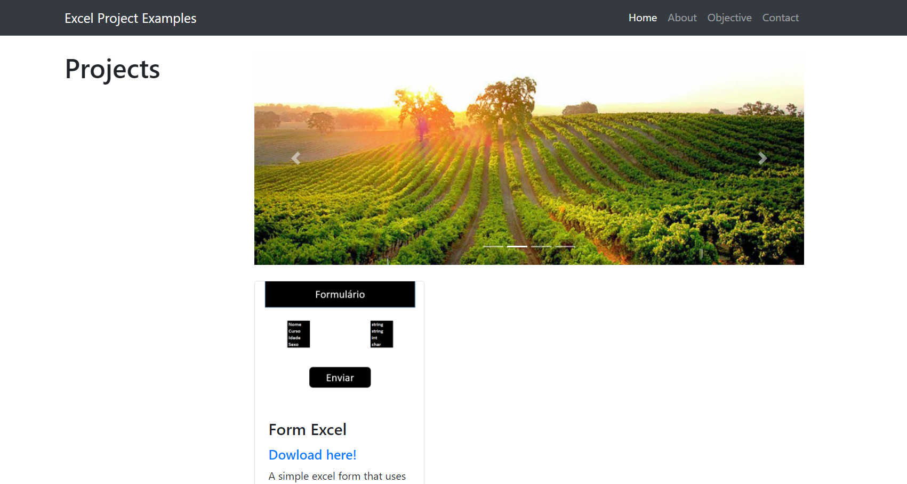

# [Excel Project Examples](https://matheus1714.github.io/projects_excel_examples/)

Web page with excel projects that I did for tool training and VBA development.

## About

I created examples in excel, but over time I became less motivated to learn more. In order to motivate myself to facilitate people on the internet in the study of Excel and VBA I created this website to facilitate its use with practical examples.

## Objective

* Motivate me to study more Excel and VBA
* Helping people looking to learn about excel
* Facilitate knowledge access

## Setup

If you want to do something like me, I leave the public repository for more people to use if they want to be motivated to study excel as well.

First you must clone the project through the link: `https://github.com/Matheus1714/projects_excel_examples.git`

To make the clone, write the code in the terminal:

```sh
$ git clone https://github.com/Matheus1714/projects_excel_examples.git
```

Go to the root of the project and then install the `npm` packages:

```sh
$ cd projects_excel_examples
$ npm i
```

## Start

To start the project you can press the `index.html` file or run the command:

```sh
$ npm start
```
## Contact

If you find any errors, send an email to matheussilvamartins1714@gmail.com.